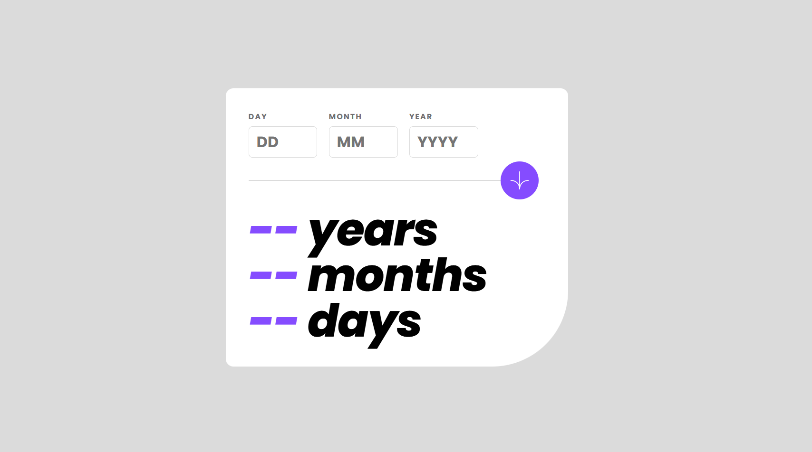
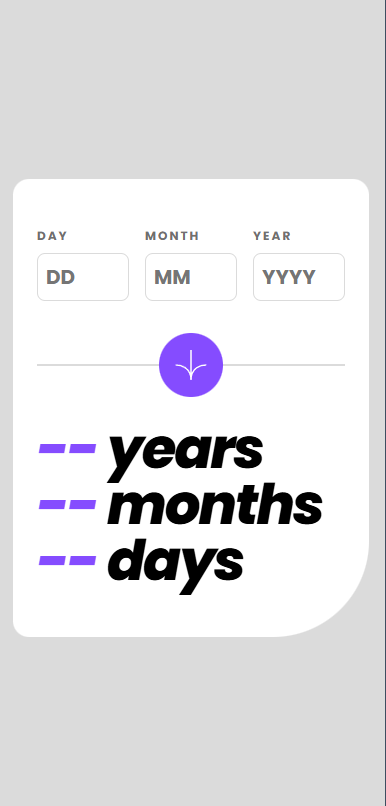
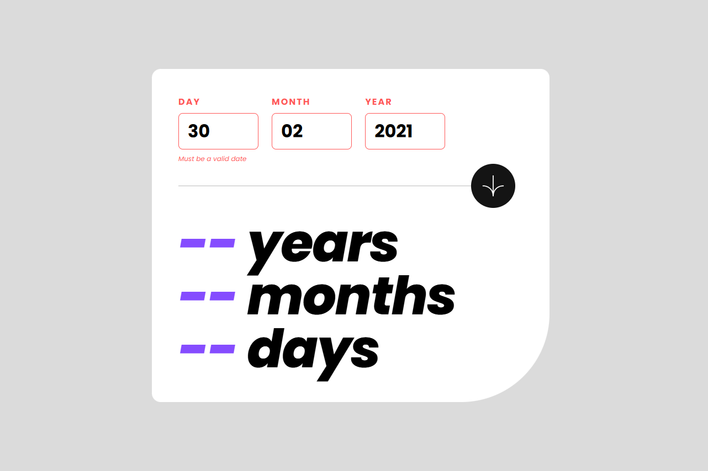

# Frontend Mentor - Age calculator app solution

This is a solution to the [Age calculator app challenge on Frontend Mentor](https://www.frontendmentor.io/challenges/age-calculator-app-dF9DFFpj-Q). Frontend Mentor challenges help you improve your coding skills by building realistic projects. 

## Table of contents

- [Overview](#overview)
  - [The challenge](#the-challenge)
  - [Screenshot](#screenshot)
  - [Links](#links)
- [My process](#my-process)
  - [Built with](#built-with)
  - [What I learned](#what-i-learned)
  - [Continued development](#continued-development)
  - [Useful resources](#useful-resources)
- [Author](#author)

**Note: Delete this note and update the table of contents based on what sections you keep.**

## Overview

### The challenge

Users should be able to:

- View an age in years, months, and days after submitting a valid date through the form
- Receive validation errors if:
  - Any field is empty when the form is submitted ***(Passed)***
  - The day number is not between 1-31 ***(Passed)***
  - The month number is not between 1-12 ***(Passed)***
  - The year is in the future ***(Passed)***
  - The date is invalid e.g. 31/04/1991 (there are 30 days in April) ***(Passed)***
- View the optimal layout for the interface depending on their device's screen size ***(Passed)***
- See hover and focus states for all interactive elements on the page ***(Passed)***
- **Bonus**: See the age numbers animate to their final number when the form is submitted ***(Skip)***

### Screenshot

### Links

- Solution URL: [My Github]([hgithub.com/helmiputeranurnashriq/FEM-age-calculator-app](https://github.com/helmiputeranurnashriq/FEM-age-calculator-app/tree/main))
- Live Site URL: [HPNA Age Calculator App](https://hpna-fem-age-calculator-app-one.vercel.app/)

## My process

### Built with

- Semantic HTML5 markup
- CSS custom properties
- Flexbox
- Javascript DOM

### What I learned

This project took almost a week to complete, with one day dedicated to designing the frontend and the remaining time spent on JavaScript.
Since most of the time was spent on JavaScript, I learned many things about the concept of the JavaScript DOM. 
Learning while practicing helped me gain a better understanding of frontend development.

Which topic that covered in this projects:

- Event Handler(target)
- Input validation
- Custom HTML (Change text content)
- Write proper name/documentation
- Function

### Continued development

After reviewing my script, I realized that it did not adhere to the DRY (Don’t Repeat Yourself) principles. There were many repetitions that could have been simplified by creating functions. However, this project was not initially planned to reach that level of complexity; its main purpose was to practice JavaScript DOM. I achieved the primary objective, and I am completely satisfied with the result.

### Useful resources

- [javascript.info](https://www.javascript.info) - Good source to learn Javascript.
- [Youtube video by Net Ninja](https://www.youtube.com/watch?v=n4B7vY9SIds&list=PL4cUxeGkcC9gfoKa5la9dsdCNpuey2s-V&index=12) - I learn Javascript DOM through this playlist. 

## Author

- Frontend Mentor - [@helmiputeranurnashriq](https://www.frontendmentor.io/profile/helmiputeranurnashriq)

